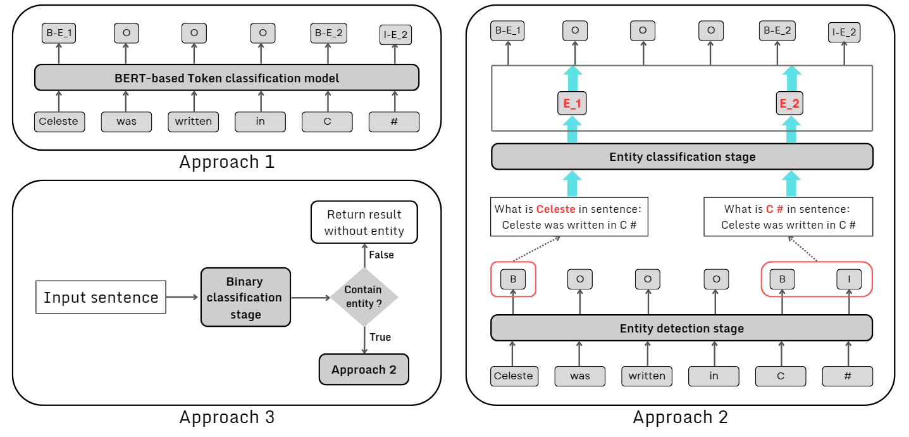

# 1. Introduce SOMD shared task
Software Mention Detection in Scholarly Publications (SOMD) shared task is part of the [Natural Scientific Language Processing and Research Knowledge Graphs (NSLP 2024)](https://nfdi4ds.github.io/nslp2024/) workshop, which is co-located with [ESWC 2024](https://2024.eswc-conferences.org/).
The  **SO**ftware  **M**ention  **D**etection in Scholarly Publications (SOMD) task will utilise the SoMeSci - Software mentions in Science - corpus. The Software Mention Detection (SOMD) shared task aims to tackle this problem by offering three distinct subtasks.
-   Subtask I: Software mention recognition.
-   Subtask II: Additional information.
-   Subtask III: Relation classification

This shared task was hosted on the CodaLab, you can find detail information of this shared task on [CodaLab - SOMD)](https://codalab.lisn.upsaclay.fr/competitions/16935).
# 2. Introduce repository
Our team achieved top 3 with F1-score of  67.80% in Subtask I - Software mention recognition. This subtask required to recognize 13 types of entity with 26 labels (IOB2 format).
In the course of participating in this subtask, we propose three approaches leveraging different pre-trained language models (BERT, SciBERT, and XLM-R) to tackle this challenge. Our best performing system addresses the named entity recognition (NER) problem through a three-stage framework:
- Stage 1: Entity Sentence Classification: classifies sentences containing potential software mentions.
- Stage 2: Entity Extraction: detects mentions within classified sentences.
- Stage 3: Entity Type Classification: categorizes detected mentions into specific software types.

In this repo, we present how to prepare data and set up three approaches subtask 1.
Folder "data" contains the original data of the organization (subtask1_train.data.txt, subtask1_train.labels.txt, subtask1_test.data.txt) and some new formats we used to train our system.
Folder "src_code" contains all source code in jupyter notebook file of our approaches. Note that we save the trained model on Hugging Face so you need to have an Hugging Face account to follow our source code or change some line of code to save trainned model at local
# 3. Approach
To address the Software Mention Recognition task, we utilize the power of different pre-trained transformer-based language model in. Figure 1 illustrates three approaches to solve this task. In our expriment, we employ various pre-trained language models, including the XLM-Roberta (XLMR) [4], BERT [7], and SciBERT [2] as our main backbones. 

**Imgage: Overview system of three approaches: Sample input is ”Celeste was written in C #” with two entities are E 1 and E 2. E 1 and E 2 play the role of two entity types in this example**

## 3.1. Approach 1: Token classification with pre-trained language models
In this approach, we tackled the problem by fine-tuning transformer models for the token classification task. In total, there are 27 labels, where 26 labels correspond to 13 types of entities and 1 label represents non-entity.

**Table 1: List of labels for token classification task in Approach 1**
| Index | Label                     | Index | Label                            |
|:-----:|---------------------------|:-----:|----------------------------------|
|   1   | B-Application_ Creation   |   15  | B-PlugIn_Deposition              |
|   2   | I-Application_ Creation   |   16  | I-PlugIn_Deposition              |
|   3   | B-Application_Deposition  |   17  | B-PlugIn_Mention                 |
|   4   | I-Application_Deposition  |   18  | I-PlugIn_Mention                 |
|   5   | B-Application_Mention     |   19  | B-PlugIn_Usage                   |
|   6   | I-Application_Mention     |   20  | I-PlugIn_Usage                   |
|   7   | B-Application_Usage       |   21  | B-ProgrammingEnvironment_Mention |
|   8   | I-Application_Usage       |   22  | I-ProgrammingEnvironment_Mention |
|   9   | B-OperatingSystem_Mention |   23  | B-ProgrammingEnvironment_Usage   |
|   10  | I-OperatingSystem_Mention |   24  | I-ProgrammingEnvironment_Usage   |
|   11  | B-OperatingSystem_Usage   |   25  | B-SoftwareCoreference_Deposition |
|   12  | I-OperatingSystem_Usage   |   26  | I-SoftwareCoreference_Deposition |
|   13  | B-PlugIn_Creation         |   27  | O                                |
|   14  | I-PlugIn_Creation         |       |                                  |
The training data for this approach at ./data/data/subtask1_approach1.csv and source code for fine-tuning XLM-R backbone at ./src_code/Approach 1_ Token_classification_baseline.ipynb
## 3.2. Approach 2: Two-stage framework for Entity Extraction and Classification  
This approach we address this shares task with a two-stage framework composed of entity extraction and entity classification components. The detail of each component is presented as below:
- Stage 1 - Entity extraction: This stage aims to identify whether each token in a given input sentence belongs to an entity or not. We achieve this through token classification, similar to Approach 1. However, instead of using 27 labels for different token types, we only use 3 labels as:  
	- O: Non-entity token  
	-  B-X: Beginning token of an entity of type X (where X represents one of the 13 entity types)
	- I-X: Token within an entity of type X

Using separate labels for the beginning (B) and inside (I) positions of tokens within an entity allows us to efficiently extract all words belonging to the  same entity in stage 2
- Stage 2 - Entity classification: In this stage, we classify the detected entities from stage 1. We use a classifier with 13 labels corresponding to the 13 entity types, discarding the B-I prefix distinction used for token position. This classifier is built by fine-tuning a transformer-based model like BERT.  During fine-tuning for classification tasks, it’s common practice to use the hidden state associated with the [CLS] token as input for a classifier. However, in this approach, we fine-tune the entire transformer model endto-end. This means the hidden states are not treated as fixed features, but  are trained alongside the classification head (a component added on top of  the pre-trained model) for optimal performance. Additionally, to leverage  the knowledge of transformer models, we format this classifier as a question and answering model by constructing the input as the following prompt:  
	- Input: What is <entity> in the sentence: <input sentence>  
	- Output: Type of entity
The training data for this approach at ./data/subtask1_approach2_stage1.csv, ./data/subtask1_approach2_stage2.csv and source code for fine-tuning at ./src_code/Approach 2_ Two-stage_framework_for_Entity_Extraction_and_Classification.ipynb

## 3.3. Approach 3: Three-stage framework  
Our analysis revealed a limited number of sentences containing entities within the training set. This disparity raised concerns about potential biases in the label information during the training process for the previously mentioned approaches. To address this, we introduce a new three-stage framework, which integrates a binary classification with Approach 2. We simply built a binary classification model to detect the sentences which contain the entity. As shown in Figure 1, if a sentence is classified as class 0, assign all tokens in the sentence as O, otherwise, this sentence will be passed to Approach 2 to extract the entity and its type.

The training data for this approach at ./data/subtask1_approach3_stage1.csv and source code for fine-tuning at ./src_code/Approach 3_ Three-stage_framewrk.ipynb
# 4. Experimental Setup
## 4.1. Data and Evaluation Metrics
We train our systems only on the provided dataset from the shared-task competitors. Sub-task I has 39768 samples in the training set and 8180 samples in the private test set. For the evaluation metrics, all systems are reported using weighted precision, recall, and F1-score.
## 4.2. System Settings
We conduct all experiments on three approaches, using three base-version backbones: XLM-R, BERT, and SciBERT. We loaded the weights of the backbones from the HuggingFace library and carried out training on an NVIDIA T4(x2) GPU provided by Kaggle. The corresponding hyper-parameters for each approach are presented below:
- Approach 1: batch size = 32, learning rate = 5e-05, and the number of epoch = 25 with XLM-R model and the number of epoch = 20 both remain  backbones.  
- Approach 2:  
	- Stage 1: batch size = 32, learning rate = 5e-05 and the number of epoch = 20 for all three backbones.  
	- Stage 2: batch size = 16, learning rate = 2e-05 and the number of epoch = 25 with XLM-R model and epoch = 20 two remainder models.  
-  Approach 3:  
	- Stage 1: batch size = 32, learning rate = 2e-5 and the number of epoch = 10 for all three backbones.  
	- Stage 2 and Stage 3: Using the configuration and architecture as the  Approach 2.
 # 5. Main result
According to the organizing committee, this sub-task will be evaluated by F1-Score based on exact matches. In table 1 we provide a tabulated summary of 9  experiments, each representing one of the 9 final systems generated from three  different approaches and using three distinct backbones.  
The experimental results in table 1 indicate that Approach 3, a three-stage  system, emonstrates the best performance across all backbones, with the XLM-RoBERTa backbone exhibiting the highest efficacy among all approaches.

**Table 1: Comparative performance of our three Approaches with different pre-trained language models on the test set**
|             |           | Approach 1 |          |           | Approach 2 |          |           | Approach 3 |          |
|-------------|:---------:|:----------:|:--------:|:---------:|:----------:|:--------:|:---------:|:----------:|:--------:|
|             | Precision |   Recall   | F1 score | Precision |   Recall   | F1 score | Precision |   Recall   | F1 score |
| BERT        |   0.675   |    0.594   |   0.625  |   0.682   |    0.643   |   0.653  |   0.690   |    0.629   |   0.650  |
| SciBERT     |   0.658   |    0.621   |   0.623  |   0.719   |    0.645   |   0.670  |   0.736   |    0.631   |   0.670  |
| XLM-RoBERTa |   0.716   |    0.614   |   0.649  |   0.707   |    0.654   |   0.671  |   0.729   |    0.649   |   0.678  |
